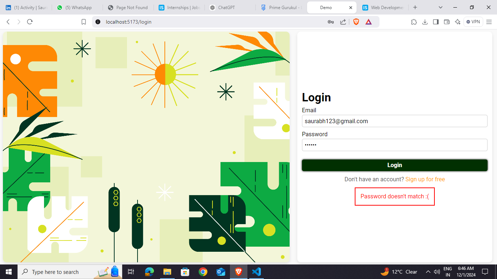

# Basic Form using mongodb
fully functional authentication page that includes a Signup Page and a Login
Page 

## Sign up 

### enpoint
/signup

### Signup Features: 🌟
- Check all the fields are covered or not.
- give alert if credentials are not give correct.
- give aleret if user sucessfully Registered.

## Signin

### endpoint
/admin

### Admin Features:
- give alert when user login correct.
- give alert if user not login correct.

---

## Tech Stack 🛠️

- **Frontend**: React.js
- **Backend**: Node.js, Express.js
- **Database**: MongoDB
- **Styling**: Basic CSS

---

### Steps to Run Locally:
1. Clone the repository:
   git clone https://github.com/RAHULTHAPLIYAL8/Form_using_mongodb
   For running the Backend-node server.js
   For running the Frontend-npm run dev

