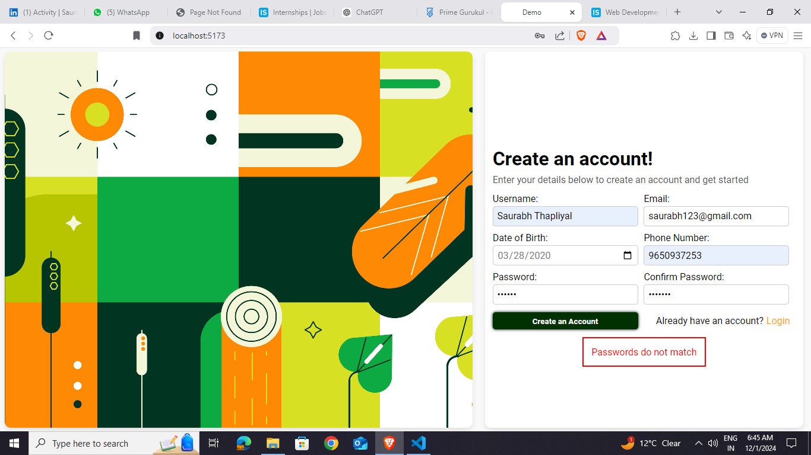

# Car Rental Website 🚗
A web application where users can seamlessly book cars of their choice, while admins have the capability to manage the inventory by adding new cars to the platform. 

## User UI

### User Features: 🌟
- Browse available cars.
- View car details.
- Book a car for specific dates.

### slug
/

## Admin UI

### slug
/admin
### Admin Features:
- Add new cars.
- Update or delete existing cars.
- Manage car availability.

---

## Tech Stack 🛠️

- **Frontend**: React.js 
- **Backend**: Node.js, Express.js
- **Database**: MongoDB
- **Styling**: CSS / Tailwind CSS
- **Authentication**: JWT (JSON Web Tokens)
---

### Steps to Run Locally:
1. Clone the repository:
   git clone https://github.com/yourusername/car-booking-website.git
   For running the Backend-node server.js
   For running the Frontend-npm run dev

